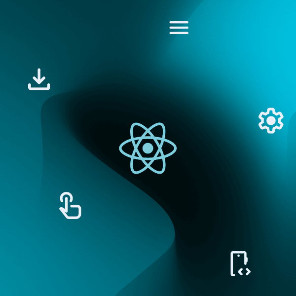

# Meta React Specialization

> Master fundamental and advanced React concepts and build dynamic, reusable, and scalable web applications.

## Overview

The **Meta React Specialization** is a two-course program from **Meta** focused on learning React from fundamental concepts through advanced development practices.

The specialization begins with reusable components, props, data flow, forms, and interactive React applications. It then progresses into advanced concepts such as Hooks, Higher-Order Components, Render Props, API integration, React testing, and reusable design patterns.

The program includes hands-on practice with industry-standard frontend technologies and concludes with building a portfolio that demonstrates React development skills.

## What You'll Learn

* React fundamentals
* Reusable components
* Props and data flow
* Dynamic and interactive applications
* React Hooks
* Higher-Order Components
* Render Props
* API integration
* Context management
* React application testing
* React Testing Library
* Reusable design patterns
* Frontend integration
* Webpack
* Building scalable and maintainable React applications

## Course Series

1. **React Basics**
2. **Advanced React**

## Prerequisites

The specialization is listed as **Intermediate** level.

A solid understanding of **JavaScript, HTML, and CSS** is useful before starting.

## Level

**Intermediate**

## Provider

**Meta**

## Format

* Video lectures
* Readings
* Quizzes and assessments
* Hands-on practice
* Programming exercises
* Applied learning projects

## Duration

Approximately **4 weeks at 10 hours per week**.

The individual courses contain approximately:

* **React Basics:** 30 hours
* **Advanced React:** 26 hours

## Topics

`React` · `JavaScript` · `Components` · `Props` · `Dataflow` · `Hooks` · `Context` · `API Integration` · `Higher-Order Components` · `Render Props` · `Testing` · `React Testing Library` · `Webpack` · `Design Patterns` · `Frontend Development`

## Certificate

A **shareable career certificate** from Meta is available through Coursera upon completion.

## Resource

[**View Specialization on Coursera**](https://www.coursera.org/specializations/meta-react-specialization)

---

*Part of* [*SkillStack*](../../../README.md) *— a curated collection of high-quality computer science and technology learning resources.*
